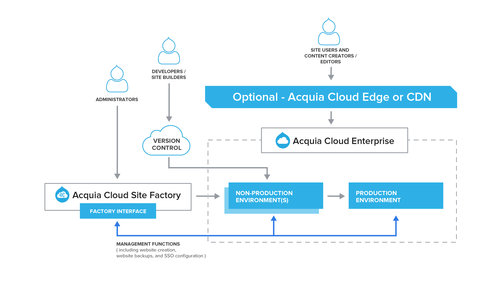

# Study Guide

## General Overview of Acquia Cloud 

This video will provide an overview of the Acquia Cloud user interface. The resources within each domain will help you investigate each topic in more depth.

* [ Acquia Cloud Onboarding: UI Walkthrough](https://www.acquiaacademy.com/lms/index.php?r=course/deeplink&course_id=8&generated_by=13029&hash=1f1bfe241229f94804c430b485eae729cb708c22)

## Study Guide by Domain

### **Domain 1.0: Fundamental Web Hosting Concepts**

#### **1.1 Demonstrate knowledge of basic web hosting architecture**

A Cloud Pro understands basic website hosting architecture.

**Resource:**

* [Acquia Cloud architecture and key concepts](https://docs.acquia.com/acquia-cloud/arch)
* [Acquia Cloud](https://docs.acquia.com/acquia-cloud/)
* [Acquia Cloud API](https://cloudapi-docs.acquia.com/)

#### **1.2 Demonstrate knowledge of Drupal development workflows**

A Cloud Pro should know how to set up workflows for Drupal development on Acquia Cloud that follow best practices, avoid regression issues, and maintain secure code.

**Resources:** 

* [Working with code](https://docs.acquia.com/acquia-cloud/manage/code/)
* [Code workflows with Acquia Cloud](https://docs.acquia.com/acquia-cloud/develop/code/environments)
* [Acquia require line](https://docs.acquia.com/acquia-cloud/manage/code/require-line/)
* [Acquia Cloud How-To](https://support.acquia.com/hc/en-us/articles/360006419794-Rolling-back-production-deploys)

#### **1.3 Demonstrate knowledge of key security and performance concepts**

A Cloud Pro should know about basic security and performance concepts in Drupal and Acquia Cloud, as well as how to identify when an application does not conform to best practices.

**Resources:** 

* [Security and compliance](https://docs.acquia.com/acquia-cloud/arch/security)
* [Best practices for a fully SSL-protected site](https://support.acquia.com/hc/en-us/articles/360005255974-Best-practices-for-a-fully-SSL-protected-site)
* [SSL and HTTPS](https://docs.acquia.com/acquia-cloud/arch/security/#cloud-ssl-and-https)

### **Domain 2.0: Acquia Cloud Features and Interface**

#### **2.1 Demonstrate understanding of key features of Acquia Cloud**

A Cloud Pro understands the key features and user interface of Acquia Cloud, including basic service levels of Acquia Cloud Professional and Acquia Cloud Enterprise.

**Resources:** 

* [Key concepts in Acquia Cloud](https://docs.acquia.com/acquia-cloud/arch/key-concepts)
* [Comparing Acquia Cloud Professional and Acquia Cloud Enterprise](https://docs.acquia.com/acquia-cloud/arch/compare-ace-acp)
* [Acquia Cloud CD](https://docs.acquia.com/acquia-cloud/cd/)
* [Managing Applications on Acquia Cloud](https://docs.acquia.com/acquia-cloud/manage/)

#### **2.2 Demonstrate ability to configure various aspects of an environment**

A Cloud Pro should be able to configure an environment appropriate for team development of an application, including modifying PHP settings, entering Sendmail path for an application, and enabling or disabling Varnish over SSL.

**Resource:** 

* [Configuring an environment](https://docs.acquia.com/acquia-cloud/manage/configure)
* [Monitoring your application and infrastructure](https://docs.acquia.com/acquia-cloud/monitor/)

#### **2.3 Demonstrate ability to configure teams and users**

A Cloud Pro should be able to set up a team and its users within Acquia Cloud, including assignment of roles, creating custom roles, and administering permissions. Also included is the management of an Organization within Acquia Cloud.

**Resources:** 

* [Managing team members](https://docs.acquia.com/acquia-cloud/access/teams/members/)
* [Working with roles and permissions](https://docs.acquia.com/acquia-cloud/access/teams/roles/)
* [Default Acquia Cloud user permissions](https://docs.acquia.com/acquia-cloud/access/teams/permissions/)
* [Creating a custom role](https://docs.acquia.com/acquia-cloud/access/teams/roles/#cloud-create-custom-role)
* [Working with organizations](https://docs.acquia.com/acquia-cloud/access/teams/organizations/)
* [Controlling access to Acquia Cloud](https://docs.acquia.com/acquia-cloud/access/)

### **Domain 3.0: Drupal Development workflow on Acquia Cloud**

#### **3.1 Demonstrate ability to install a new Drupal site on Acquia Cloud**

A Cloud Pro should be able to install a new Drupal site on Acquia Cloud by creating a new application, importing an existing application, or installing a Drupal distribution.

**Resources:** 

* [Creating a new application on Acquia Cloud](https://docs.acquia.com/acquia-cloud/create)
* [Installing a Drupal distribution](https://docs.acquia.com/acquia-cloud/create/install)
* [Importing an existing application](https://docs.acquia.com/acquia-cloud/create/import)
* [Acquia BLT](https://docs.acquia.com/blt/)

#### **3.2 Demonstrate ability to set up a local development environment for working with Acquia Cloud**

A Cloud Pro will be able to set up a local development environment.

**Resources:** 

* [Acquia Dev Desktop](https://docs.acquia.com/dev-desktop)
* [Getting started with Acquia Dev Desktop](https://docs.acquia.com/dev-desktop/start)
* [Deploying an Application to Acquia Cloud Using Acquia Dev Desktop](https://www.acquiaacademy.com/lms/index.php?r=course/deeplink&course_id=228&generated_by=13029&hash=f07cd59fdc4891f1d9737fdbbc92a685117a99f3)
* [Deploying an Application to Acquia Cloud using GIT/SQL-dump](https://www.acquiaacademy.com/lms/index.php?r=course/deeplink&course_id=241&generated_by=13029&hash=8c9e7862a507cc1f8808cd4f56966aaf45e3c582)
* [Deploying an Application to Acquia Cloud using BLT/Drupal 8](https://www.acquiaacademy.com/lms/index.php?r=course/deeplink&course_id=91&generated_by=13029&hash=ae1ea53213d8f0091ee11406c0321ca3c7c010f0)
* [Acquia Pipelines](https://docs.acquia.com/acquia-cloud/develop/pipelines/)

#### **3.3 Demonstrate ability to deploy code, database, and files to various environments**

A Cloud Pro will be able to deploy code, database, and files to various environments on Acquia Cloud, using a workflow that follows best practices.

**Resources:** 

* [Working with code](https://docs.acquia.com/acquia-cloud/manage/code/)
* [Code workflows with Acquia Cloud](https://docs.acquia.com/acquia-cloud/develop/code/environments)
* [Working with files](https://docs.acquia.com/acquia-cloud/manage/files)
* [Backing up your Drupal file system](https://docs.acquia.com/acquia-cloud/manage/back-up/)
* [rsyncing files on Acquia Cloud](https://docs.acquia.com/acquia-cloud/manage/files/transfer-files/rsync/)
* [Using Production mode to protect your live application](https://docs.acquia.com/acquia-cloud/manage/prod-mode)
* [Acquia require line](https://docs.acquia.com/acquia-cloud/manage/code/require-line/)

#### **3.4 Demonstrate ability to manage Drupal site configurations across various environments**

A Cloud Pro will be able to manage site configurations for a Drupal application across environments.

**Resources:** 

* [Configuring your environments](https://docs.acquia.com/acquia-cloud/manage/configure)
* [Managing applications using the command line](https://docs.acquia.com/acquia-cloud/ssh)
* [Enabling SSL](https://docs.acquia.com/acquia-cloud/manage/ssl/)
* [Custom VCL engagements](https://docs.acquia.com/acquia-cloud/ready/customvcl)
* [Developing with the Cloud API](https://docs.acquia.com/acquia-cloud/api)

#### **3.5 Demonstrate ability to use Cloud API for workflow automation**

A Cloud Pro will be able to use the Acquia Cloud API to automate workflows for development, authentication, drush and cloud hooks.

**Resources:** 

* [Cloud API authentication](https://docs.acquia.com/acquia-cloud/develop/api/auth/)
* [Drush Cloud reference](https://docs.acquia.com/acquia-cloud/develop/api/drush-reference/)
* [Automating with Cloud Hooks](https://docs.acquia.com/acquia-cloud/develop/api/cloud-hooks/)
  * [Acquia Cloud Hooks](https://github.com/acquia/cloud-hooks)
  * [10 Ways Acquia Cloud Hooks can help you sleep at night](https://dev.acquia.com/blog/10-ways-acquia-cloud-hooks-can-help-you-sleep-night)
  * [Using Cloud Hooks on Acquia Cloud Hosting](https://www.mediacurrent.com/blog/using-cloud-hooks-acquia-cloud-hosting/)

### **Domain 4.0: Acquia Cloud Best Practices**

#### **4.1 Demonstrate understanding of best practices for performance enhancement**

A Cloud Pro will understand best practices for performance enhancement of Drupal applications, including basic application performance, Drupal performance, and maintaining the required level of performance for your application.

**Resources:** 

* [Improving application performance](https://docs.acquia.com/acquia-cloud/performance)
* [Using Fast 404 to improve Drupal performance](https://support.acquia.com/hc/en-us/articles/360005246714-Using-Fast-404-to-improve-Drupal-performance)

#### **4.2 Demonstrate understanding of security best practices**

A Cloud Pro will understand security best practices related to access control, managing team members and permissions, and whitelisting.

**Resources:** 

* [Controlling access to Acquia Cloud](https://docs.acquia.com/acquia-cloud/access)
* [Managing users, teams, roles, and permissions](https://docs.acquia.com/acquia-cloud/access/teams/)
* [Managing security settings](https://docs.acquia.com/acquia-cloud/access/security)
* [Enforcing password strength](https://docs.acquia.com/acquia-cloud/access/password-strength)
* [Setting up two-step verification](https://docs.acquia.com/acquia-cloud/access/two-step-verification)
* [Using two-step verification with your Acquia user account](https://docs.acquia.com/acquia-cloud/access/signin)
* [Securing your application with IP address whitelisting](https://docs.acquia.com/acquia-cloud/access/ip-whitelist)

#### **4.3 Demonstrate understanding of best practices for Live Deployment**

A Cloud Pro will understand the best practices related to live deployment, including basic tools, live code changes, and workflow.

**Resources:** 

* [Managing your code with other tools](https://docs.acquia.com/acquia-cloud/manage/code/other/)
* [Using Live Development mode to change code on your server](https://docs.acquia.com/acquia-cloud/manage/code/livedev/)
* [Live Development workflow](https://docs.acquia.com/acquia-cloud/manage/code/livedev-workflow/)

## Additional Resources

The following are additional resources provided for your supplemental learning and practice.

**Acquia Cloud infrastructure**

The [Acquia Cloud architecture and key concepts](https://docs.acquia.com/acquia-cloud/arch) section of the Acquia Cloud documentation describes how Acquia Cloud works, including information about Acquia Cloud's architecture, security, high availability features, and compliance with standards and regulations.

As indicated in the two diagrams below, there are four main components for both Acquia Cloud Enterprise and Acquia Cloud Professional applications:

* _Reverse proxy caching and load balancing servers_ - Varnish/nginx
* _Web servers_ - Apache with PHP and Drupal code
* _Database servers_ - MySQL \(Percona\)
* _Network file system_ - \(GlusterFS\)

The exact configuration of an Acquia Cloud application's infrastructure depends on several factors, including whether the application is part of Acquia Cloud Enterprise or Acquia Cloud Professional.

**Acquia Cloud Enterprise infrastructure diagram**

Here is a diagram of an Acquia Cloud Enterprise application and how the components interact with one another for different user profiles: ****

**Acquia Cloud Professional infrastructure diagram**

As a comparison, the following is an example of an Acquia Cloud Professional application, and its component interactions:

**Acquia Cloud Site Factory infrastructure diagram**

The [Acquia Cloud Site Factory and Acquia Cloud](https://docs.acquia.com/site-factory/acquia-cloud/features) section of the Acquia Cloud documentation describes the supported and included features of Acquia Cloud Site Factory, which is built upon Acquia Cloud Enterprise.

The following diagram describes the infrastructure used for the Acquia Cloud Site Factory application, and how its components interact with one another:

**Cloud videos in Acquia Academy**

* [Acquia Cloud Hands-On Demonstration](https://www.acquiaacademy.com/lms/index.php?r=course/deeplink&course_id=276&generated_by=13029&hash=0486344754712ae568658a46de77b8b2c8018817)
* [Acquia Cloud Onboarding: Learning Plan](https://www.acquiaacademy.com/lms/index.php?r=coursepath/deeplink&id_path=2&generated_by=13029&hash=cbf41fe0629c3af9e0b62e3d2fdf8ebb34fa4594)
* [Acquia Cloud Onboarding: UI Walkthrough](https://www.acquiaacademy.com/lms/index.php?r=course/deeplink&course_id=8&generated_by=13029&hash=1f1bfe241229f94804c430b485eae729cb708c22)

**Caching and Varnish**

* [Configuring Drupal cache settings for Varnish](https://docs.acquia.com/acquia-cloud/performance/varnish/#drupal-cache-settings-varnish)
* [How Drupal page cache works](https://docs.acquia.com/resource/caching/drupal/)
* [Caching overview](https://docs.acquia.com/resource/caching/)
* [Views caching](https://docs.acquia.com/acquia-cloud/manage/code/other/)
* [Using Varnish](https://docs.acquia.com/acquia-cloud/performance/varnish)
* [Introduction to Varnish](https://support.acquia.com/hc/en-us/articles/360005853313-Introduction-to-Varnish)
* [Bypassing the Varnish cache](https://docs.acquia.com/acquia-cloud/performance/varnish/#sts=Bypassing%20the%20Varnish%20cache%C2%B6)
* [Purging Varnish cache on Acquia Cloud](https://docs.acquia.com/acquia-cloud/performance/varnish/purging/)
* [Simplified VCL for Varnish](https://support.acquia.com/hc/en-us/articles/360005540293-Simplified-VCL-for-Varnish)
* [Set max-age headers for specific pages, files, or paths](https://support.acquia.com/hc/en-us/articles/360004311534-Set-max-age-headers-for-specific-pages-files-or-paths)
* [Custom Varnish configuration \(VCL\) for Acquia Cloud Enterprise applications](https://docs.acquia.com/acquia-cloud/performance/varnish/custom/)
* [Installing Acquia Purge](https://docs.acquia.com/resource/caching/purge/)

    
****Learn more about the Acquia Certification Program at [https://acquia.com/certification](https://www.gitbook.com/book/acquia-academy/acquia-study-guide-cloud-ui-pro-certification-exa/edit#).

